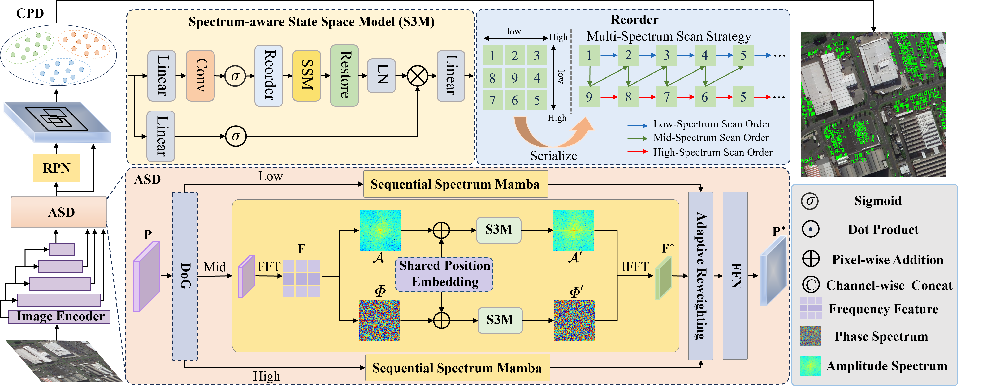
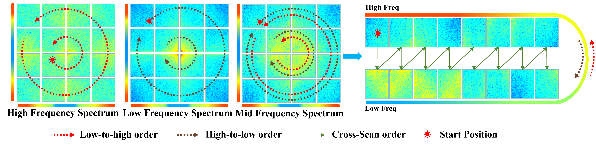

<div align="center">

<h1>Adaptive Spectrum-Aware Feature Disentangled Network for Small Object Detection</h1>

<div>
    <strong>Yang Guo</strong><sup>1</sup> &emsp;
    <strong>Zihan Yang</strong><sup>2</sup> &emsp;
    <strong>Feifei Kou</strong> &emsp;
    <strong>Yulan Hu</strong> &emsp;
    <strong>Ran Zhang</strong> &emsp;
    <strong>Siyuan Yao</strong><sup>*</sup>
</div>
<br>
<div>
    <sup>1</sup> Beijing University of Posts and Telecommunications (BUPT)<br>
    <sup>2</sup> Beijing University of Aeronautics and Astronautics (BUAA)
</div>
<br>
<div>
    <sup>*</sup> <em>Corresponding author</em>
</div>
<br>

[](#)

---

</div>

> **🎉 Accepted by ECCV 2026**  
> Official PyTorch implementation of **SFDNet**.

📌 **Note:** This branch contains the **OBB** version code. If you are looking for the **HBB (Horizontal Bounding Box / Rotate)** version, please switch to the [`HBB`](../../tree/HBB) branch.

## 📖 Abstract

Small Object Detection (SOD) is a fundamental yet challenging problem in computer vision due to its limited spatial resolution and weak visual cues. Although recent approaches have achieved remarkable advances, the background distractors in different frequency spectra still degrade the performance. In this paper, we propose a novel small object detection framework termed **SFDNet**, which is capable of detecting small objects via efficient spectrum-aware feature disentanglement. Specifically, we propose an **Adaptive Spectrum Disentanglement (ASD)** module that decomposes backbone features into multiple complementary spectral components, aiming to construct discriminative object-relevant representations by discarding the background distractors for each component. Afterwards, to strengthen the semantic consistency of similar objects in the same class, we propose a **Class-Wise Prototype Distillation (CPD)** procedure, which establishes class prototypes for the object instances and enforces compact representation by efficient prototype distillation. Extensive experiments on multiple challenging benchmarks show that SFDNet outperforms existing state-of-the-art methods by a large margin.

---

## 🎬 Overview

<p align="center">
  
</p>

<p align="center">
  
</p>

<p align="center">
  
</p>

---

## 🎯 Performance

> **Note:** Metrics follow COCO-style evaluation. **Bold** numbers indicate the best results. † denotes results trained using the official implementation.

### Table 1. AI-TOD Benchmark
* **Training Set:** AI-TOD trainval set
* **Testing Set:** AI-TOD test set (36 epochs)

| Method | Source | AP | AP<sub>50</sub> | AP<sub>75</sub> | AP<sub>vt</sub> | AP<sub>t</sub> | AP<sub>s</sub> | AP<sub>m</sub> |
| :--- | :---: | :---: | :---: | :---: | :---: | :---: | :---: | :---: |
| DAB-DETR | ICLR2022 | 4.9 | 16.0 | 1.7 | 1.7 | 3.6 | 7.0 | 18.0 |
| DAB-Deformable-DETR | ICLR2022 | 16.5 | 42.6 | 9.9 | 7.9 | 15.2 | 23.8 | 31.9 |
| DINO-Deformable-DETR | ICLR2023 | 23.2 | 56.6 | 15.4 | 9.9 | 23.1 | 29.3 | 37.6 |
| DINO-5scale w/ SET | CVPR2025 | 26.6 | 57.1 | 20.8 | 13.2 | 27.1 | 31.5 | -- |
| Faster R-CNN | TPAMI2017 | 11.1 | 26.3 | 7.6 | 0.0 | 7.2 | 23.3 | 33.6 |
| Cascade R-CNN | CVPR2018 | 13.8 | 30.8 | 10.5 | 0.0 | 10.5 | 25.5 | 36.6 |
| DetectorRS | CVPR2021 | 14.8 | 32.8 | 11.4 | 0.0 | 10.8 | 28.3 | 38.0 |
| QueryDet | CVPR2022 | 12.2 | 29.3 | 7.9 | 2.4 | 10.5 | 18.5 | 26.3 |
| CFINet† | ICCV2023 | 24.7 | 53.9 | 18.6 | 11.7 | 26.4 | 28.1 | 32.2 |
| RFLA | ECCV2022 | 24.8 | 55.2 | 18.5 | 9.3 | 24.8 | 30.3 | 38.2 |
| DNTR | TGRS2024 | 26.2 | 56.7 | 20.2 | 12.8 | 26.4 | 31.0 | 37.0 |
| SimD | IROS2024 | 26.6 | 55.9 | 21.2 | 13.4 | 27.5 | 30.9 | 37.8 |
| DetectorRS w/FIDP | CVPR2025 | 24.3 | 54.4 | 18.3 | 8.5 | 24.9 | 29.8 | -- |
| HS-FPN | AAAI2025 | 25.1 | 55.7 | 19.1 | 12.1 | 25.3 | 29.9 | 36.9 |
| SFDNet | -- | 29.0 | 57.9 | 23.5 | 14.4 | 29.0 | 33.4 | 40.8 |
| **SFDNet\*** | -- | **31.7** | **64.9** | **25.6** | **17.6** | **32.8** | **36.1** | **42.5** |

### Table 2. SODA-D Benchmark
* **Training Set:** SODA-D train set
* **Testing Set:** SODA-D test set (12 epochs)

| Method | Source | AP | AP<sub>50</sub> | AP<sub>75</sub> | AP<sub>es</sub> | AP<sub>rs</sub> | AP<sub>gs</sub> | AP<sub>N</sub> |
| :--- | :---: | :---: | :---: | :---: | :---: | :---: | :---: | :---: |
| Faster R-CNN | TPAMI2017 | 28.9 | 59.7 | 24.2 | 13.9 | 25.6 | 34.3 | 43.2 |
| RetinaNet | ICCV2017 | 28.2 | 57.6 | 23.7 | 11.9 | 25.2 | 34.1 | 44.2 |
| CornerNet | ECCV2018 | 24.6 | 49.5 | 21.7 | 6.5 | 20.5 | 32.2 | 43.8 |
| FCOS | ICCV2019 | 23.9 | 49.5 | 19.9 | 6.9 | 19.4 | 30.9 | 40.9 |
| RepPoints | ICCV2019 | 28.0 | 55.6 | 24.7 | 10.1 | 23.8 | 35.1 | 45.3 |
| ATSS | CVPR2020 | 26.8 | 55.6 | 22.1 | 11.7 | 23.9 | 32.2 | 41.3 |
| Cascade RPN | NeurIPS2019 | 29.1 | 56.5 | 25.9 | 12.5 | 25.5 | 35.4 | 44.7 |
| Deformable-DETR | ICLR2021 | 19.2 | 44.8 | 13.7 | 6.3 | 15.4 | 24.9 | 34.2 |
| Sparse R-CNN | CVPR2021 | 24.2 | 50.3 | 20.3 | 8.8 | 20.4 | 30.2 | 39.4 |
| DyHead | CVPR2021 | 27.5 | 56.1 | 23.2 | 12.4 | 24.4 | 33.0 | 41.9 |
| RFLA | ECCV2022 | 29.7 | 60.2 | 25.2 | 13.2 | 26.9 | 35.4 | 44.6 |
| CFINet | ICCV2023 | 30.7 | 60.8 | 26.7 | 14.7 | 27.8 | 36.4 | 44.6 |
| KLDet | TGRS2024 | 25.9 | 53.8 | 21.4 | 10.7 | 22.2 | 31.9 | 41.6 |
| DNTR† | TGRS2024 | 29.6 | 57.8 | 26.5 | 13.1 | 26.7 | 35.5 | 43.4 |
| CFPT† | TGRS2025 | 27.5 | 54.5 | 23.8 | 7.1 | 22.4 | 36.2 | 45.9 |
| HS-FPN† | AAAI2025 | 29.6 | 56.8 | 26.7 | 13.6 | 26.4 | 35.3 | 45.3 |
| Unc-SOD | TIP2026 | 31.0 | 60.8 | 27.1 | 14.9 | 27.6 | 36.9 | 45.8 |
| SFDNet | -- | 31.3 | 62.1 | 26.8 | 15.1 | 27.8 | 37.3 | 46.2 |
| SFDNet\* | -- | 34.2 | 64.0 | 31.3 | 16.7 | 30.7 | 40.6 | 50.4 |
| **SFDNet\*(newest)** | -- | **35.1** | **65.6** | **32.2** | **17.4** | **31.8** | **41.3** | **51.6** |

### Table 3. SODA-A Benchmark (Oriented Object Detection)
* **Training Set:** SODA-A train set
* **Testing Set:** SODA-A test set (12 epochs)

| Method | Source | AP | AP<sub>50</sub> | AP<sub>75</sub> | AP<sub>es</sub> | AP<sub>rs</sub> | AP<sub>gs</sub> | AP<sub>N</sub> |
| :--- | :---: | :---: | :---: | :---: | :---: | :---: | :---: | :---: |
| Rotated Faster R-CNN | PAMI2017 | 32.5 | 70.1 | 24.3 | 11.9 | 27.3 | 42.2 | 34.4 |
| Rotated RetinaNet | ICCV2017 | 26.8 | 63.4 | 16.2 | 9.1 | 22.0 | 35.4 | 28.2 |
| Gliding Vertex | PAMI2020 | 31.7 | 70.8 | 22.6 | 11.7 | 27.0 | 41.1 | 33.8 |
| Oriented R-CNN | ICCV2021 | 34.4 | 70.7 | 28.6 | 12.5 | 28.6 | 44.5 | 36.7 |
| S²A-Net | TGRS2021 | 28.3 | 69.6 | 13.1 | 10.2 | 22.8 | 35.8 | 29.5 |
| DODet | TGRS2022 | 31.6 | 68.1 | 23.4 | 11.3 | 26.3 | 41.0 | 33.5 |
| Oriented RepPoints | CVPR2022 | 26.3 | 58.8 | 19.0 | 9.4 | 22.6 | 32.4 | 28.5 |
| DHRec | PAMI2022 | 30.1 | 68.8 | 19.8 | 10.6 | 24.6 | 40.3 | 34.6 |
| CFINet | ICCV2023 | 34.4 | 73.1 | 26.1 | 13.5 | 29.3 | 44.0 | 35.9 |
| DecoupleNet† | TGRS2024 | 36.6 | 71.3 | 33.3 | 12.2 | 31.0 | 47.7 | 40.2 |
| LEGNet† | ICCVW2025 | 29.6 | 58.7 | 26.4 | 10.4 | 26.0 | 39.6 | 32.0 |
| GauCho† | CVPR2025 | 33.2 | 70.1 | 25.0 | 9.9 | 27.8 | 44.9 | 36.4 |
| UGS | ICCV2025 | 36.0 | 73.1 | 30.3 | 13.7 | 30.2 | 47.8 | 38.1 |
| DCFL | PAMI2025 | 36.6 | 72.6 | 32.4 | 13.9 | 30.3 | 47.4 | 41.2 |
| Unc-SOD | TIP2026 | 34.8 | 73.6 | 26.4 | 13.8 | 29.7 | 44.7 | 36.5 |
| SFDNet | -- | 37.8 | 73.1 | 34.5 | 13.1 | 32.1 | 49.4 | 42.9 |
| **SFDNet\*** | -- | **39.2** | **75.0** | **36.6** | **15.5** | **33.7** | **50.4** | **45.6** |

---

## 🛠️ Get Started

### 1. Environment Setup

```bash
# Create conda environment with Python 3.8
conda create -n SFDNet_R python=3.8 -y
conda activate SFDNet_R

# Upgrade pip and Install PyTorch 1.12.0 with CUDA 11.3 support
pip install --upgrade pip
pip install torch==1.12.0+cu113 torchvision==0.13.0+cu113 torchaudio==0.12.0 --extra-index-url https://download.pytorch.org/whl/cu113

# Install basic requirements
pip install -r requirements.txt

# Compile Selective Scan kernel
cd kernels/selective_scan && pip install -e . && cd ../..

# Compile Depth-wise Convolution kernel
cd kernels/dwconv2d && python setup.py install && cd ../..

# Install mmcv-full using openmim
pip install -U openmim
mim install mmcv-full==1.7.2

# Install MMRotate extension
cd detection/mmrotate && pip install -e . && cd ../..
```
🔧 Code Modification (Important)

To ensure training proceeds correctly, a minor patch needs to be applied to the installed `mmcv` library file:

> 📌 **Target Path:** > `YOUR_CONDA_ENV_PATH/SFDNet_R/lib/python3.8/site-packages/mmcv/runner/epoch_based_runner.py`

```python
# ... Existing Code ...
# Insert data_batch['epoch'] = self.epoch right before the train_step call
data_batch['epoch'] = self.epoch
outputs = self.model.train_step(data_batch, self.optimizer, **kwargs)
# ... Existing Code ...
```
### 2. Dataset Preparation
The SODA dataset is processed following the protocol of CFINet. We provide the pre-processed datasets below:

- **SODA-A**: [Google Drive](link) | [Quark Drive](link)

Please arrange your dataset directories as follows:
```
└── SODA-A
    ├── divData
    │   ├── test
    │   │   ├── Annotations
    │   │   │   └── [json files]
    │   │   └── Images
    │   │       └── [image files]
    │   ├── train
    │   │   ├── Annotations
    │   │   │   └── [json files]
    │   │   └── Images
    │   │       └── [image files]
    │   └── val
    │       ├── Annotations
    │       │   └── [json files]
    │       └── Images
    │           └── [image files]
    └── rawData
        ├── test
        │   ├── Annotations
        │   │   └── [json files]
        │   ├── AnnsWoIgnore
        │   │   └── [json files]
        │   └── Images
        │       └── [image files]
        ├── train
        │   ├── Annotations
        │   │   └── [json files]
        │   ├── AnnsWoIgnore
        │   │   └── [json files]
        │   └── Images
        │       └── [image files]
        └── val
            ├── Annotations
            │   └── [json files]
            ├── AnnsWoIgnore
            │   └── [json files]
            └── Images
                └── [image files]
```

### 3. Download Pretrained Weights

For the Mamba version of SFDNet, please download the required pretrained weights for the Spatial-Mamba Backbone from the links below. Available sizes are listed in the following table:

<table>
  <tr>
    <!-- Base -->
    <td align="center" valign="top" width="33%">
      <table>
        <thead>
          <tr><th>Model Size</th><th>Download Link</th></tr>
        </thead>
        <tbody>
          <tr>
            <td><strong>Base</strong></td>
            <td><a href="https://drive.google.com/file/d/1k8dHp2QRCOqBSgAi36YkhZp_O8LqOPjM/view">Google Drive</a></td>
          </tr>
        </tbody>
      </table>
    </td>
    <!-- Small -->
    <td align="center" valign="top" width="33%">
      <table>
        <thead>
          <tr><th>Model Size</th><th>Download Link</th></tr>
        </thead>
        <tbody>
          <tr>
            <td><strong>Small</strong></td>
            <td><a href="https://drive.google.com/file/d/1Wb3sYoWLpgmWrmHMYKwdgDwGPZaqM28O/view">Google Drive</a></td>
          </tr>
        </tbody>
      </table>
    </td>
    <!-- Tiny -->
    <td align="center" valign="top" width="33%">
      <table>
        <thead>
          <tr><th>Model Size</th><th>Download Link</th></tr>
        </thead>
        <tbody>
          <tr>
            <td><strong>Tiny</strong></td>
            <td><a href="https://drive.google.com/file/d/19kXoqGSTuKKs4AHbdUSrdKZTwTWenLIW/view">Google Drive</a></td>
          </tr>
        </tbody>
      </table>
    </td>
  </tr>
</table>

### 4. Train & Evaluation

#### Configuration Setup

Before training, please ensure the following configurations are correctly set:

1. **Dataset Paths**: Update the `data_root` variable to your local dataset path in the following files:
   - `SFDNet/detection/configs/_base_/datasets/aitod-detection.py`
   - `SFDNet/detection/configs/_base_/datasets/sodad-detection.py`
   - `SFDNet/detection/mmrotate/configs/_base_/datasets/sodaa.py`

2. **Pretrained Weights**: Update the `pretrained` argument in your specific model config file to point to the downloaded checkpoint path.

3. **Model Architecture (Optional)**: To switch between different backbones, you need to modify the model backbone configuration and ensure the **FPN channel dimensions** are properly aligned.

#### Training
```bash
# CNN version
python tools/train.py mmrotate/configs/SFDNet/sodaa/SFDNet_CNN.py --work-dir SFDNet_CNN [--amp]

# Mamba version
python tools/train.py mmrotate/configs/SFDNet/sodaa/SFDNet_Mamba.py --work-dir SFDNet_Mamba [--amp]
```

#### Evaluation
```bash
# CNN version
python tools/test.py mmrotate/configs/SFDNet/aitoa/SFDNet_CNN.py SFDNet_CNN/epoch_xxx.pth

# Mamba version
python tools/test.py mmrotate/configs/SFDNet/sodaa/SFDNet_Mamba.py SFDNet_Mamba/epoch_xxx.pth
```

### 5. Model Zoo

We provide the complete pretrained checkpoints for evaluating and reproducing the results of **SFDNet**. Please download the corresponding weights for both the CNN-based and Mamba-based (`SFDNet*`) architectures across different datasets (AI-TOD, SODA-D, and SODA-A) from the table below:
<table>
  <tr>
    <td align="center" valign="top" width="33%">
      <table>
        <thead>
          <tr><th colspan="2" style="text-align: center;">AI-TOD checkpoint</th></tr>
          <tr><th>Model</th><th>Download Link</th></tr>
        </thead>
        <tbody>
          <tr>
            <td>SFDNet (CNN)</td>
            <td><a href="https://pan.quark.cn/s/79a08a2c3ed6?pwd=9Hp3#/list/share/a03cbec766e34c9e97b605df4ec9c5e7">Quark Drive</a></td>
          </tr>
          <tr>
            <td>SFDNet* (Mamba)</td>
            <td><a href="https://pan.quark.cn/s/79a08a2c3ed6?pwd=9Hp3#/list/share/e96b5ad63d754207b420faa342c64f63">Quark Drive</a></td>
          </tr>
        </tbody>
      </table>
    </td>
    <td align="center" valign="top" width="33%">
      <table>
        <thead>
          <tr><th colspan="2" style="text-align: center;">SODA-D checkpoint</th></tr>
          <tr><th>Model</th><th>Download Link</th></tr>
        </thead>
        <tbody>
          <tr>
            <td>SFDNet (CNN)</td>
            <td><a href="https://pan.quark.cn/s/79a08a2c3ed6?pwd=9Hp3#/list/share/a03cbec766e34c9e97b605df4ec9c5e7">Quark Drive</a></td>
          </tr>
          <tr>
            <td>SFDNet* (Mamba)</td>
            <td><a href="https://pan.quark.cn/s/79a08a2c3ed6?pwd=9Hp3#/list/share/e96b5ad63d754207b420faa342c64f63">Quark Drive</a></td>
          </tr>
        </tbody>
      </table>
    </td>
    <td align="center" valign="top" width="33%">
      <table>
        <thead>
          <tr><th colspan="2" style="text-align: center;">SODA-A checkpoint</th></tr>
          <tr><th>Model</th><th>Download Link</th></tr>
        </thead>
        <tbody>
          <tr>
            <td>SFDNet (CNN)</td>
            <td><a href="https://pan.quark.cn/s/79a08a2c3ed6?pwd=9Hp3#/list/share/a03cbec766e34c9e97b605df4ec9c5e7">Quark Drive</a></td>
          </tr>
          <tr>
            <td>SFDNet* (Mamba)</td>
            <td><a href="https://pan.quark.cn/s/79a08a2c3ed6?pwd=9Hp3#/list/share/e96b5ad63d754207b420faa342c64f63">Quark Drive</a></td>
          </tr>
        </tbody>
      </table>
    </td>
  </tr>
</table>

## 📬 Contact
* **Yang Guo:** [guoyang4409@gmail.com](mailto:guoyang4409@gmail.com)
* **Siyuan Yao:** [yaosiyuan04@gmail.com](mailto:yaosiyuan04@gmail.com)

## 🤝 Acknowledgements
Special thanks to the authors of [CFINet](https://github.com/shaunyuan22/CFINet), [RFLA](https://github.com/Chasel-Tsui/mmdet-rfla), and the [Spatial-Mamba](https://github.com/EdwardChasel/Spatial-Mamba) library, which helped us quickly implement our ideas.

## ✏️ Citation
If you find this project helpful for your research, please consider leaving a star ⭐️ and citing our paper:
```bibtex
coming soon.
```
